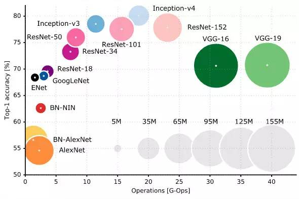
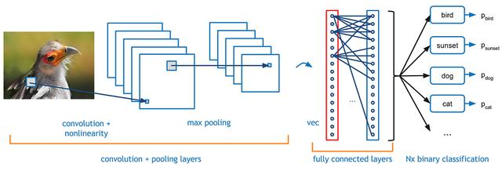
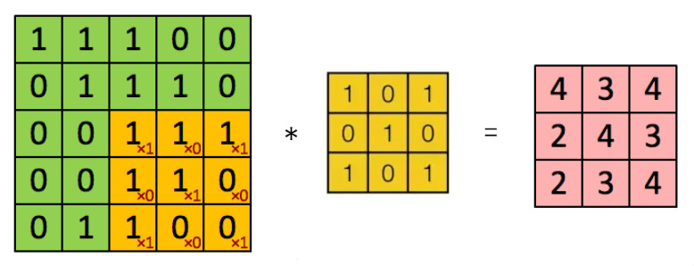
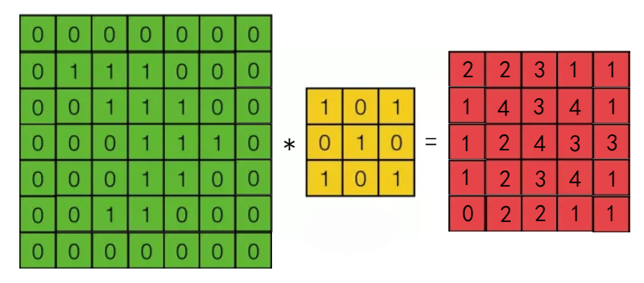
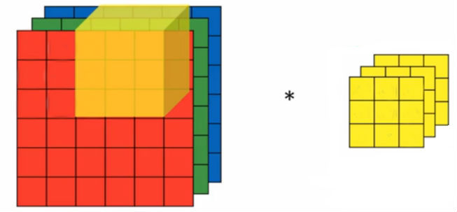
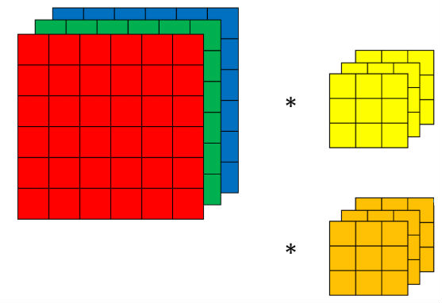
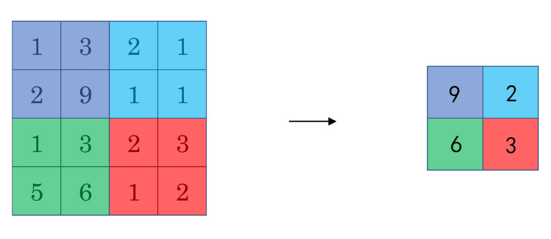
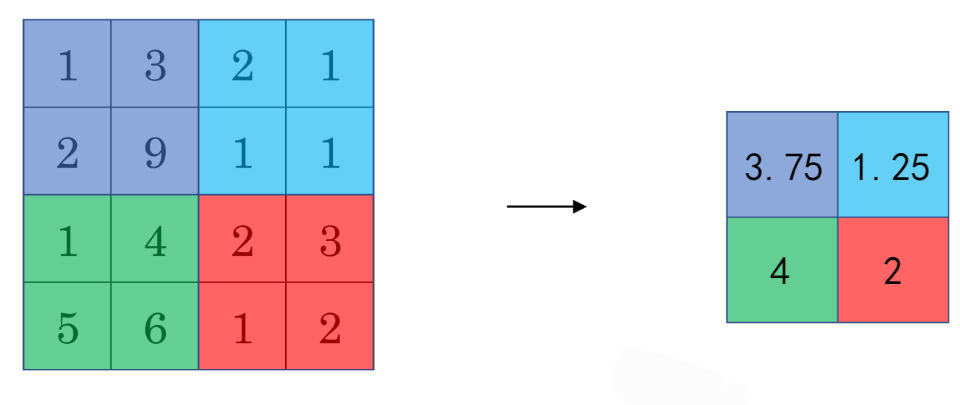
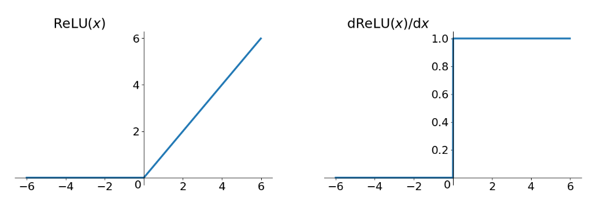

# 卷积神经网络

## 3.1 卷积神经网络简介

卷积神经网络（Convolutional Neural Network,CNN）是一种常见的深度学习架构，其初期主要是用来解决图像识别的问题，但早期由于缺乏训练数据和计算能力，要在不产生过拟合的情况下训练高性能卷积神经网络是很困难的。近年来GPU的发展，使得卷积神经网络研究涌现并取得一流结果，其表现的应用已经不仅仅应用在图像方面了，可运用在音频、自然语言处理等方面。

卷积神经网络受生物自然视觉认知机制启发而来，20世纪 90 年代，LeCun et al. 等人发表论文，确立了CNN的现代结构，后来又对其进行完善。他们设计了一种多层的人工神经网络，取名叫做LeNet-5，可以对手写数字做分类。2006年起，人们设计了很多方法，想要克服难以训练深度CNN的困难。其中，最著名的是 Krizhevsky et al.提出了一个经典的CNN 结构，并在图像识别任务上取得了重大突破。其方法的整体框架叫做 AlexNet，与 LeNet-5 类似，但要更加深一些。AlexNet 取得成功后，研究人员又提出了其他的完善方法，其中最著名的要数 VGGNet, GoogleNet和 ResNet这四种。从结构看，CNN 发展的一个方向就是层数变得更多，ILSVRC 2015 冠军 ResNet 是 AlexNet 的20 多倍，是 VGGNet 的8 倍多。通过增加深度，网络便能够利用增加的非线性得出目标函数的近似结构，同时得出更好的特性表征。但是，这样做同时也增加了网络的整体复杂程度，使网络变得难以优化，很容易过拟合,当然，研究人员们也提出了很多方法来解决这一问题。下图对比了目前各种卷积神经网络之间，复杂度和精度之间的关系。



在下面的章节中，我们会先详细介绍CNN的原理、结构，并一起探讨一下LeNet、AlexNet、VGGNet，并给大家看一个有趣的小例子。


## 3.2卷积神经网络的原理

卷积神经网络通过卷积来模拟特征区分，并且通过卷积的权值共享及池化，来降低网络参数的数量级，最后通过传统神经网络完成分类等任务。

那么为什么不用传统的神经网络来做图像识别呢？从下面的例子就可以很容易的理解。如果我们采用传统的神经网络来处理一张1000*1000像素的黑白图片，即只有一个颜色通道，那么一张图片就有100万个像素点，如果我们连接一个相同大小的隐藏层，那么将产生100万×100万=1万亿个连接，这还仅仅是一层全连接层，计算量就已经无法接受了。我们必须减少需要训练的权重数量，一是降低训练的复杂度，二十过多的连接很容易造成过拟合，减少连接可以降低模型的泛华能力。

图像在空间上是有组织结构的，每一个像素点在空间上和周围的像素点是紧密联系的，但是和太远的点就没有太大的关系了，因此，每一个神经元并不需要接受所有的像素点的信息，只需要接受局部的像素点作为输入，而后将这些局部信息综合起来就可以得到全局的信息。这样就把之前的全连接改变成了局部连接，如果我们取的局部信息大小是10×10，那么现在就只有10×10×100万=1亿个连接，相比之前的1万亿缩小了1万倍。

虽然我们从1万亿降低到了1亿，但是数量还是很多，因此，引入了卷积的操作，即让每一个隐藏层的节点参数一样，所有我们的参数最终只有10×10=100个即卷积核的大小，并且无论图像有多大都是100个，这就是卷积核的作用。我们不需要担心有多少个隐藏节点，图像有多大，参数量只和卷积核的大小有关系，这就是权值共享。但是如果我们只采用一个卷积核显然是不够的，每一个卷积核只能提取出图像中的一种特征，如果我们引入了多个卷积核，即可提取图像中多种特征，好在图像中的特征并不多，每一张图像都是有最基础的点、线组成，当神经元接收到这些点线特征后，传到下一层在组合成更高级的特征，比如三角形，正方形，再继续抽象出眼睛、鼻子，最后五官组合成了一张脸，从而完成了图像识别。因此我们的问题就很好解决了，只需要提供更多的卷积核，提取出更多的特征，一般来说，我们把100个卷积核放在第一个卷积层就很充足了，这样的话，我们的参数就是100×100=1万，相比之前的1亿我们又降低了10000倍。因此依靠卷积，我们就可以高效的训练局部连接神经网络了。

## 3.2卷积神经网络的结构

卷积神经网络一般由卷积层、池化层、全连接层组成。其中卷积层与池化层配合，组成多个卷积组，逐层提取特征，最终通过若干个全连接层完成分类。



### 3.2.1 卷积层（Convolution）

对图像进行卷积操作实际的操作过程是一个滑动的窗口对原图像像素做乘积然后求和。如图所示，我们有一个5x5的图像，我们用一个3x3的卷积核做卷积操作，如果我们的滑动步长（卷积核每次移动的格数）是1，可得到：



假设输入图像大小为n×n过滤器大小为f×f步长为s，则输出图像大小为：

$$ \frac{(n−f+1)}{s} * \frac {(n−f+1)}{s}$$


但是这样做卷积运算是有一个缺点的，卷积图像的大小会不断缩小，另外图像的角落的元素只被一个输出所使用，所以在图像边缘的像素在输出中采用较少，也就意味着你丢掉了很多图像边缘的信息，为了解决这两个问题，就引入了padding操作，也就是在图像卷积操作之前，沿着图像边缘用0进行图像填充,就可以保证输出图像和输入图像一样大。 



假设输入图像大小为n×n过滤器大小为f×f步长为s引入的padding为p，则输出图像大小为：

$$ [\frac{(n+2p−f)}{s}+1] * [\frac{(n+2p−f)}{s}+1] $$

对于单色道的黑白图片，我们只需要一个信道，如果想要在RGB图像上进行卷积，卷积核的大小就不在是n×n而是n×n×3，最后的3对应为通道数。卷积时就是图像中每个n×n×3的卷积核对应的值与图像的值进行相乘累加。




其次，在具体应用中我们往往会检测多种特征，例如同时检测垂直边缘、水平边缘、45度边缘等等，也就是多个过滤器的问题。对于上面的情况，在只有一个卷积核的时候最后生成的图片是二维的，如果有m个滤器，最终生成图像为三维的n×n×m的立方体。



### 3.2.2池化层 （Pooling）

池化层是CNN的重要组成部分，通过减少卷积层之间的连接，降低运算复杂程度。池化层一般有两种形式，最大池化层和平均池化层。

最大池化思想很简单，以下图为例，把4×4的图像分割成4个不同的区域，然后输出每个区域的最大值，这就是最大池化所做的事情。其实这里我们选择了2*2的过滤器，步长为2。在一幅真正的图像中提取最大值可能意味着提取了某些特定特征，比如垂直边缘、一只眼睛等等。 



平均池化和最大池化唯一的不同是，它计算的是区域内的平均值而最大池化计算的是最大值。在日常应用使用最多的还是最大池化。




### 3.2.3 激活层 （Activation）

在经过池化层后，我们通常会对输出进行一个非线性映射，因为卷积计算和池化计算是一种线性计算，如果不引入非线性映射的话，无论有多少层神经网络，输出都是输入的线性组合，这与一层隐藏层的效果相当。常见的激活函数有relu、tanh、sigmoid等，一般使用relu。

在反向传播计算梯度中，使用relu求导明显会比tanh和sigmoid简单，可以减少计算量。
同时，使用tanh和sigmoid，当层数较多时容易导致梯度消失，因为tanh和sigmoid的导数均小于1（可参考激活函数的导数公式），当我们神经网络有多层的时候，每层都要乘以这个小于1的导数，就有可能接近于0，这就是所谓的梯度消失。而使用relu求导，若输出不为0时，导数均为1，可以有效避免梯度消失问题。另外，relu还会将小于0的映射为0，使得网络较为稀疏，减少神经元之间的依赖，避免过拟合。



### 3.2.4 全连接层 （Fully Connect）

当获取到足以用来识别图片的特征后，接下来的就是如何进行分类。 全连接层就可以用来将最后的输出映射到线性可分的空间。 通常卷积网络的最后会将末端得到的高维数据平摊维一维的向量，并送入全连接层配合sigmoid层或softmax进行最后的分类。

这里也体现了深度神经网络或deep learning之所以称deep的一个原因：模型将特征抓取层和分类层合在了一起，负责特征抓取的卷积层主要是用来学习“如何观察“。

## 3.3 Keras实现一个卷积神经网络

在了解完CNN的基本概念之后，本节我们会带领大家用keras来实现一个简单的卷积神经网络，使用的数据是MNIST，MNIST 数据集来自美国国家标准与技术研究所, 数据集由来自 250 个不同人手写的数字构成,包括0-9共10个数字，我们的任务是正确识别出手写数字。本节将会构建一个非常简单并且有代表性的卷及神经网络，预期可达到99%的准确率，读者可通过该例子掌握keras搭建卷及神经网络的要点。

首先载入MNIST数据集，这里直接采用tensorflow内置的获取mnist数据的方法，该方法会把数据下载到对应的目录中，因此执行以下方法时读者需等待片刻。当然读者也可自行下载，地址为：http://yann.lecun.com/exdb/mnist/ 注意，这里在读取数据时read_data_sets方法的one_hot参数必须设置为True,因为我们这里是一个10分类的问题，label标签要求是独热编码，如果用户自行下载数据注意把label标签做one-hot处理。

```
from tensorflow.examples.tutorials.mnist import input_data
mnist = input_data.read_data_sets('mnist/', one_hot=True)
train_X = mnist.train.images
train_y = mnist.train.labels
test_X = mnist.test.images
test_y = mnist.test.labels
```

数据读取完成后，我们对数据的维度进行查看。

```
train_X.shape

out:(55000, 784)
```

可以看到，我们读取的数据是二维的，第一个维度表示的是图片的数量，第二个维度是图片的像素集，我们需要把这一维的数据转换为一个28×28×1的数据集，其中28表示图片的长宽，由于图片是单色道即黑白图片，因此第三个维度是1。我们这里使用reshape方法来改变数据维度。

```
train_X = train_X.reshape(-1, 28, 28, 1)
test_X = test_X.reshape(-1, 28, 28, 1)
```

接下来就是建模的过程，由于模型比较简单，我们这里采用序贯模型Sequential。首先，我们创建第一个卷基层，其中filters表示卷积核的个数，kernel_size表示卷积核的大小，padding表示填充方式，其中包括“valid”与“same”，“valid”代表只进行有效的卷积，即对边界数据不处理，“same”代表保留边界处的卷积结果，通常会导致输出shape与输入shape相同，input_shape表示输入数据的维度，注意，如果是第一层卷基层，必须提供该参数。接下来我们引入一些非线性的变化操作添加一个relu激活函数。最后，使用一个2×2的最大池化层对卷积的输出结果做池化操作，其中pool_size表示赤化层的大小。

```
from keras.layers import Activation, MaxPooling2D, Dropout, Flatten, Dense, Conv2D
from keras.models import Sequential

model = Sequential()

model.add(Conv2D(filters=32, kernel_size=(5, 5),padding='valid',input_shape=(28, 28, 1)))
model.add(Activation('relu'))
model.add(MaxPooling2D(pool_size=(2, 2)))
```

然后我们定义我们的第二个池化层，这个卷基层和第一层类似，只是卷积核的数量我们改为了64。

```
model.add(Conv2D(filters=64, kernel_size=(5, 5),padding='valid'))
model.add(Activation('relu'))
model.add(MaxPooling2D(pool_size=(2, 2)))
```

在经过上面两个卷基层之后，我们的图片大小最后为5×5，由于最后一个卷基层的卷积核是64，所以我们最后拿到的输出结果维度是5×5×64。为了方便加入后面的分类，我们这里加入一个Flatten层，Flatten层用来将输入“压平”，即把多维的输入一维化，常用在从卷积层到全连接层的过渡。然后连接一个全连接层，并加入relu激活函数，为了防止过拟合，我们添加一个Dropout层，然后我们连接一个10维的全连接层，最后我们把得到的结果输入到softmax层，从而得到最后的概率。

```
model.add(Flatten())
model.add(Dense(128))
model.add(Activation('relu'))
model.add(Dropout(0.5))
model.add(Dense(10))
model.add(Activation('softmax'))
```

模型建立完成之后，我们来定义损失函数，优化算法与评估指标，其中损失函数我们采用多分类常使用的croos entropy，优化方法我们采用adam，评估指标是准确率。

```
model.compile(loss='categorical_crossentropy',
              optimizer='adam',
              metrics=['accuracy'])
```

下面就是我们的训练过程了，其中batch_size表示mini-batch的大小，epochs表示训练的迭代次数，verbose表示是否打印日志，0为不在标准输出流输出日志信息，1为输出进度条记录，2为每个epoch输出一行记录。

```
model.fit(train_X, train_y, batch_size=128, epochs=10, verbose=1)
```

训练完成后，我们可以在测试集上进行测试，得到最终的测试结果。

```
score = model.evaluate(test_X, test_y, batch_size=128, verbose=0)
print('Test accuracy:', score[1])

out:Test accuracy: 0.9923
```

可以看到，我们这么简单的一个卷积神经网络，准确率已经高达99.37%，可见卷积层对图像的特征提取是十分有用的，并且依靠卷积核的参数共享，训练效率得到了很大的提升。在后面的文章中，我们会给大家介绍一些更加复杂且效果更好的卷积神经网络，这些网络在各大比赛中都取得了优异的成绩，读者可借鉴这些网络的优点来搭建自己的神经网络，当然也可以采用迁移学习的方法直接使用预先训练好的模型来完成自己的图像识别任务。

## 3.4 Keras实现经典的卷积神经网络

本节将会带领大家实现一个简单的卷积神经网络，并在CIFAR-10数据集上进行验证。CIFAR-10是一个经典的数据集，其中包含了60000张32×32像素的彩色图像，其中训练集有50000张，测试集有10000张，CIFAR-10如同其名字，一共标注了10类数据，也就是说这将是一个10分类的图像问题，目前现有的神经网络已经对CIARF-10数据做了非常好的学习，但其复杂度也较高，本节将会使用一个简单的CNN来对数据进行训练，最终的效果在70%左右。

本章将介绍三种经典的卷积神经网络，分别是LeNet、AlexNet、VGGNet，这四种网络依照出现的先后顺序排列，深度和复杂度也一次递增。这三个卷积神经网络都在各自的年代使用了先进的网络结构，对于深度学习来说都有很大的推进作用，也象征着这几年神经网络的快速发展

### 3.4.1 Keras实现LeNet

### 3.4.2 Keras实现AlexNet

### 3.4.3 Keras实现VGGNet


## 3.5 用Keras搭建一个猫狗识别系统

